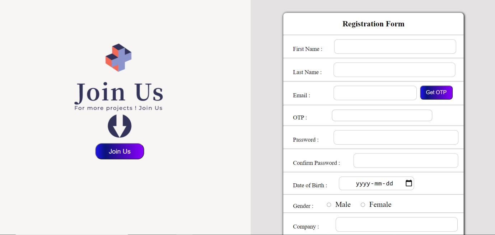
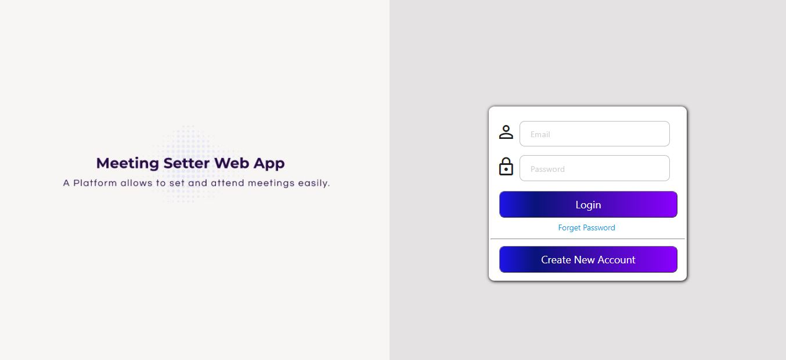
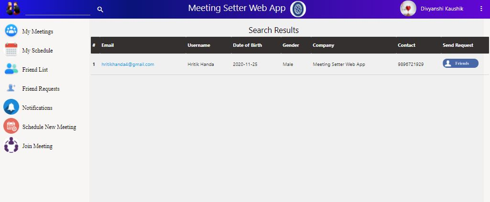
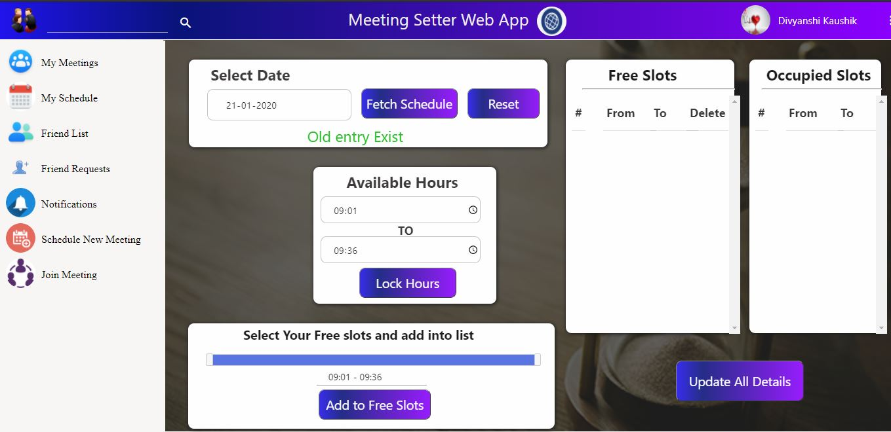
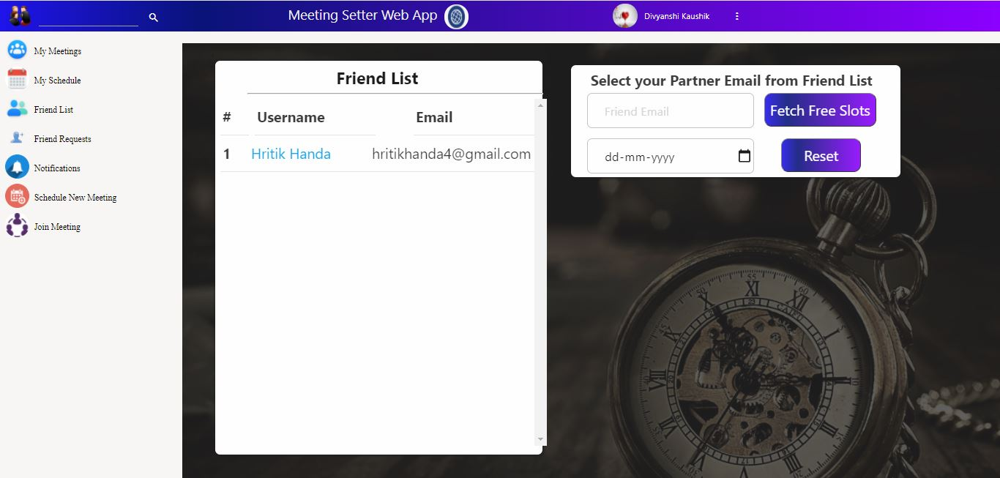
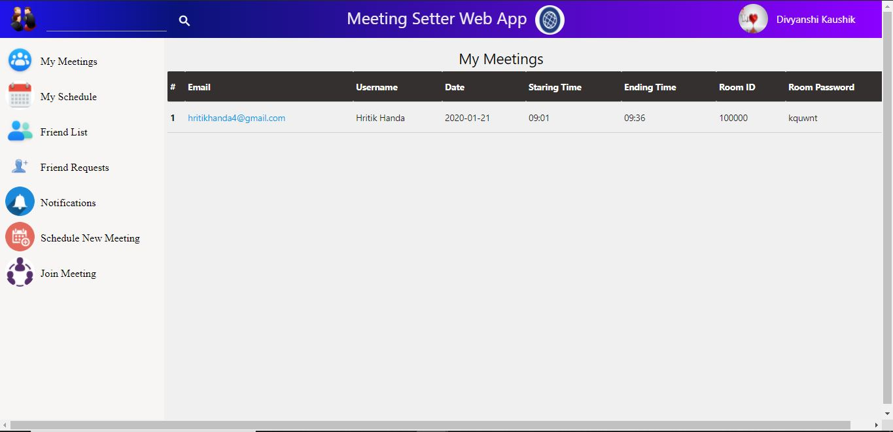
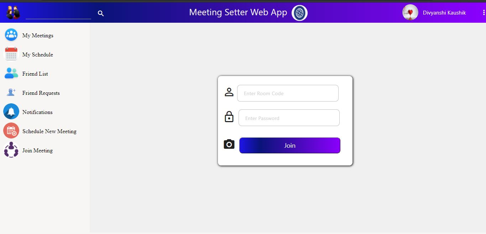
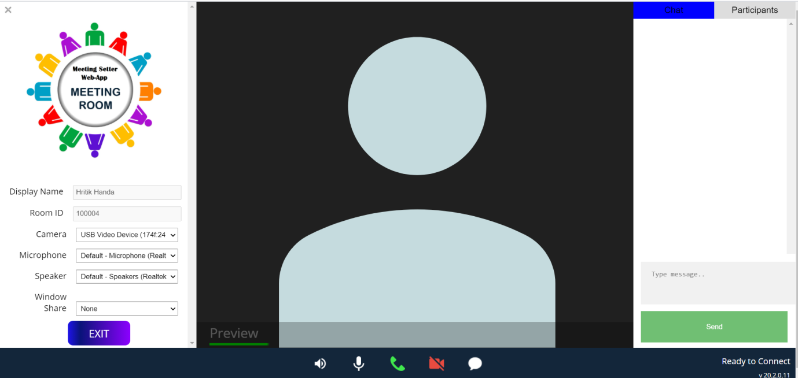

# Meeting-Setter-Web-App

Creator: Hritik Handa - hritikhanda4@gmail.com        
Co-Creator: Divyanshi Kaushik – divyanshikaushik88@gmail.com 

<h4>Introduction</h4>
MEETING SETTER WEB APPLICATION is the video conference chat service in which people can create profiles, add friends in their friend list, manage their schedule by updating the free slots and connect to their friends together for real time interaction.

<b>Note: </b>There is no need to download this application as it is in your web browser. It can be particularly beneficial for users who are having problems installing desktop apps or are in a locked-down environment who cannot download software.
<h4>Why use the Web App?</h4>
Setting up a meeting with friend is always an easy task but collaboration with customers, clients or boss is not easy. MEETING SETTER WEB APPLICATION provides the facility to the customer to fix meetings with the members of the friend list in their free slots. Slots will be updated themselves if meeting has been fixed.

<h4>Features</h4>
<ul>
•	Easy to use 
•	Setting up meeting according to your and partner mutual free slots 
•	Easy User Interface 
•	Adding friends and accepting invites 
•	High-quality Video Conference Call 
•	Chat with participants 
•	Screen Sharing with participants 
•	Video and audio preview screen 
•	Setting and Attending Meetings at one place 

</ul>
<h4>Technologies Used:</h4>
<ul>

1.	Front-end – HTML CSS, client side Javascript
2.	Back-end technologies – Java, Servlet, Jsp, JDBC
3.	Database- IBM-DB2
4.	Others- AJAX 

</ul>

<h4>How to Use:</h4>
1.	Open a Google Chrome browser. 
2.	Go to http://3.139.39.16:8080/Meeting%20Setter%20Web%20App/ 
3.	Create your Account. 

4.	Login your Account.
 

5.	Add friends in your friend List
 
 

6.	Update your schedule by managing free slots.
 

7.	Fix your meeting with your friends in their free slot. Room id and password will be generated.
 

8.	Details for joining a meeting are shown in MY MEETING folder.
 

9.	Enter room id and password for joining a meeting.

 

10.	Attend your meeting

<pre><b>                                                      ReadMe Written By Hritik Handa<b></pre>

